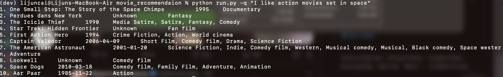

# AI/Machine Learning Intern Challenge: Simple Content-Based Recommendation

By [Lijun Cai](https://lijunc04.github.io)

I tried implementing TF-IDF on a movie summary database.

## Database & Download 

Database from [CMU Movie Summary Corpus](https://www.cs.cmu.edu/~ark/personas/). This project only uses `movie.metadata.tsv` and `plot_summaries.txt` (~90Mb), both in this github repo and can be downloaded from the official site. 

## Requirements:

```sh
pip install -r requirements.txt
```

## Run

Basic Run:

```sh
python run.py -q "YOUR QUERY"
```

For example:

```sh
python run.py -q "I like action movies set in space"
```

By default, the program reads first 4k rows from `movie.metadata.tsv`. To change this (to 1k, for example):

```sh
python run.py -q "YOUR QUERY" -r 1000
```

By default, the program gives you top 10 recommendations. To change this (to 20, for example):

```sh
python run.py -q "YOUR QUERY" -n 20
```

## Sample Run



   1. One Small Step: The Story of the Space Chimps 	 1995 	 Documentary
   2. Perdues dans New York 	 Unknown 	 Fantasy
   3. The Icicle Thief 	 1990 	 Media Satire, Satire, Fantasy, Comedy
   4. Star Trek: Hidden Frontier 	 Unknown 	 Fan film
   5. First Action Hero 	 1994 	 Crime Fiction, Action, World cinema
   6. Captain Valedor 	 2006-04-09 	 Short Film, Comedy film, Drama, Science Fiction
   7. The American Astronaut 	 2001-01-20 	 Science Fiction, Indie, Comedy film, Western, Musical comedy, Musical, Black comedy, Space western, Adventure
   8. Lookwell 	 Unknown 	 Comedy film
   9. Space Dogs 	 2010-03-18 	 Comedy film, Family Film, Adventure, Animation
   10. Aar Paar 	 1985-11-22 	 Action

## Improvements

- Memory optimization 
  - It is using too much memory right now. I can optimize the way vectors are stored in the future (a lot of zeroes in the vectors that are being stored right now).
- Accuracy
  - TF-IDF on movie summary gives a limited search accuracy. There are more sophisticated algorithms (DL/RL related) that utilizes more movie data (user, location, etc.) which will produce much better results. 
- Time complexity
  - There are libraries out there that implements TF-IDF much faster than my implementation. 

## Salary Expectation

$25 per hour

